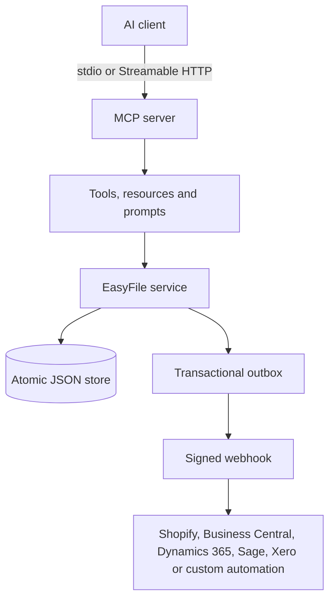

# EasyFile MCP architecture

The server turns EasyFile's independent browser modules into a consistent MCP business layer.

## Module boundaries

| Module | Primary entities | Cross-module workflow |
|---|---|---|
| CRM | Customers | Customer links on commercial records |
| Quote | Quotes and lines | Quote → invoice or sales order |
| Invoice | Invoices and balances | Receipt → invoice balance/status |
| Receipt | Receipts | Payment allocation |
| Sales Order | Sales orders | Fulfilment → stock issue |
| Purchase Order | Purchase orders | Receipt → stock receipt |
| Job Card | Jobs, labour and parts | Job card → invoice |
| Inventory | Items and movements | Order-driven movements |
| Payroll | Employees and payroll runs | Explicit-rate calculations |

## Persistence and consistency

The reference implementation uses a single JSON database and atomic rename on every mutation. Each mutation writes an audit entry and an outbox event in the same persistence operation. This is suitable for a single-process pilot. For multi-instance production, replace `JsonStore` with PostgreSQL while keeping `EasyFileService` and MCP tool contracts stable. Use tenant-scoped row-level security, idempotency keys and database transactions.

## Integration pattern

The generic webhook is the executable integration boundary. Every event is signed with HMAC-SHA256 in `x-easyfile-signature`, carries a unique delivery ID, and remains pending until a 2xx response. Downstream adapters can route events to Shopify, Microsoft Dynamics 365 Business Central, Dynamics 365 Sales, Sage, Xero, Power Automate or custom APIs. Connector descriptors expose configuration state without exposing secrets.

## Security boundary

- `stdio` inherits the local process boundary.
- HTTP supports bearer authentication and an explicit browser-origin allowlist.
- The server binds to `127.0.0.1` by default.
- Secrets are environment-only and excluded from MCP resources and tool responses.
- Webhooks require HTTPS, except loopback development, and have a 15-second timeout.
- Tool input is validated with Zod; errors are returned without stack traces.
- Payroll rates are explicit inputs. The server does not claim to calculate statutory tax obligations.
